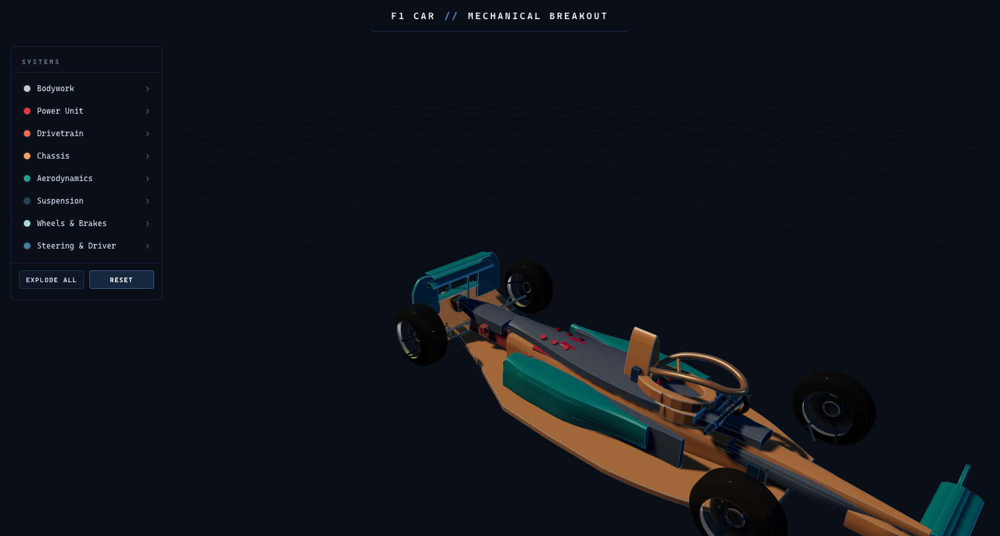
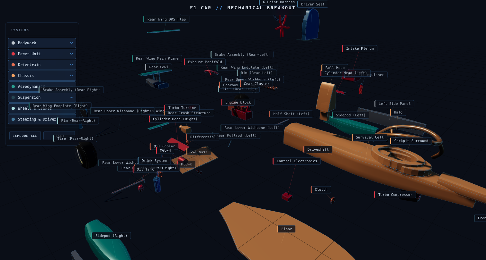

# F1 CAR // MECHANICAL BREAKOUT

An interactive 3D exploded-view diagram of a Formula 1 car, built entirely with [Three.js](https://threejs.org/) — no external models, just procedural geometry.



## Overview

Every part of the car — from the carbon-fibre monocoque to the Pirelli-branded tires — is constructed in code using vertex-deformed high-poly geometry, custom shaders, and canvas-generated textures. Click **Explode All** to cascade every system outward and reveal 70+ individually labeled components.



## Systems

| System | Parts | Description |
|--------|-------|-------------|
| **Bodywork** | Upper/lower shell, nose fairing, side panels, rear cowl | Outer carbon-fibre body panels and aerodynamic shell |
| **Power Unit** | V6 engine block, turbo, MGU-K, MGU-H, energy store | 1.6L turbocharged hybrid powertrain |
| **Drivetrain** | Gearbox, gear cluster, clutch, differential, driveshafts | 8-speed sequential semi-automatic transmission |
| **Chassis** | Survival cell, halo, floor, diffuser, crash structures | Carbon-fibre monocoque with safety structures |
| **Aerodynamics** | Front/rear wings, endplates, sidepods, beam wing | Downforce generation and airflow management |
| **Suspension** | Upper/lower wishbones, pushrods, pullrods | Multi-link push-rod (front) and pull-rod (rear) |
| **Wheels & Brakes** | Tires, rims, brake assemblies | Carbon-carbon brakes with Pirelli tire textures |
| **Steering & Driver** | Steering wheel with LCD, pedals, harness, HANS, seat | Full cockpit with canvas-rendered dashboard display |

## Features

- **Cascade explosion** — systems fly apart in sequence with tween-animated transitions, then auto-reassemble
- **Per-system toggle** — click any system in the sidebar to explode/collapse it independently
- **Part inspection** — click any part to see its name and description in the detail panel
- **Orbit controls** — drag to rotate, scroll to zoom, right-drag to pan
- **Procedural geometry** — smoothstep-sculpted shapes with coke-bottle tapering, airfoil profiles, and organic contours
- **Canvas textures** — steering wheel LCD display with RPM bar, gear indicator, and telemetry; Pirelli sidewall branding on tires

## Tech Stack

- [Three.js](https://threejs.org/) (r170) — WebGL rendering, PBR materials, shadow maps
- [Tween.js](https://github.com/tweenjs/tween.js/) — smooth explosion/reassembly animations
- CSS2DRenderer — floating part labels
- Vanilla HTML/CSS/JS — no build step required

## Getting Started

Serve the project directory with any static file server:

```bash
# Python
python3 -m http.server 8000

# Node
npx serve .
```

Then open `http://localhost:8000` in your browser.

## Architecture

### How the geometry works

There are no `.glb` or `.obj` model files — every part is built at runtime from Three.js primitives (`BoxGeometry`, `LatheGeometry`, `ExtrudeGeometry`, `TubeGeometry`, etc.). The trick that makes them look organic rather than boxy is **vertex deformation**: after creating a high-subdivision box (e.g. `BoxGeometry(w, h, l, 8, 6, 24)`), each vertex is repositioned with `smoothstep` and `lerp` functions to carve out coke-bottle tapers, airfoil profiles, undercuts, and dome surfaces. This happens once at build time — the resulting buffer geometry is static and cheap to render.

Canvas-generated textures (steering wheel LCD, Pirelli sidewall branding) are painted with the 2D Canvas API, then wrapped in `THREE.CanvasTexture` and applied as material maps.

### Part definition pattern

Each file in `js/parts/` exports an array of **part definitions** — plain objects that describe a component:

```js
{
  id: 'survivalCell',
  name: 'Survival Cell',
  group: 'chassis',
  description: 'Carbon-fibre monocoque tub...',
  assembledPosition: [0, 0.15, -0.1],
  assembledRotation: [0, 0, 0],
  explosionDirection: [0, -1, 0],
  build({ addEdgeLines }) { /* returns THREE.Mesh or THREE.Group */ }
}
```

`main.js` iterates every part definition, calls `build()`, places the resulting mesh at its `assembledPosition`, and registers it with the system managers. This pattern keeps geometry creation decoupled from scene logic — each part file is self-contained.

### System managers

Four singleton modules in `js/systems/` handle runtime behavior:

```
                    ┌──────────────┐
                    │   main.js    │  builds parts, wires systems, runs render loop
                    └──────┬───────┘
                           │ registers parts + meshes
              ┌────────────┼────────────────┐
              ▼            ▼                ▼
    ┌─────────────┐  ┌───────────┐  ┌──────────────┐
    │  explosion   │  │interaction│  │    label      │
    │  Manager     │  │ Manager   │  │   Manager     │
    └──────┬──────┘  └─────┬─────┘  └───────┬──────┘
           │               │                │
           │  state machine│  raycaster     │  CSS2DObjects
           │  per group    │  hover/click   │  show/hide on
           │  (ASSEMBLED → │  resolves part │  group events
           │   EXPLODING → │  from mesh     │
           │   EXPLODED ↔  │  ancestry      │
           │   REASSEMBLING│               │
           │   → ASSEMBLED)│               │
           └───────┬───────┘               │
                   │  CustomEvents          │
                   │  'group-exploded'      │
                   │  'group-assembled'     │
                   └───────────────────────►┘
                                ▲
                    ┌───────────┴──────────┐
                    │  animation Manager   │  calls TWEEN.update()
                    │  (per-frame driver)  │  each requestAnimationFrame
                    └──────────────────────┘
```

- **Explosion Manager** — owns a state machine per group (`ASSEMBLED → EXPLODING → EXPLODED → REASSEMBLING → ASSEMBLED`). When a group explodes, each part's target position is computed by blending two vectors: 40% from the group centroid outward, 60% from an explicit `explosionDirection` defined on the part. Parts are sorted by distance from centroid and stagger-tweened with `TWEEN.Easing.Back.Out` for a satisfying pop. The cascade order (bodywork first, drivetrain last) is a hardcoded array that peels the car from outside in.

- **Interaction Manager** — sets up a `THREE.Raycaster` on pointer events. On hover, it walks the scene graph upward from the hit mesh to find the top-level interactive object, then applies an emissive highlight. On click, behavior depends on group state: assembled parts trigger an explode toggle; exploded parts fire a `show-part-detail` CustomEvent that populates the detail panel. It also tweens the camera to frame a group after it explodes.

- **Label Manager** — attaches a `CSS2DObject` label and a `THREE.Line` leader to each part as children of its mesh. Labels start hidden and fade in when `group-exploded` fires. Each frame, it updates leader-line endpoints and adjusts label opacity based on camera distance (closer = more opaque). A simple O(n^2) screen-space overlap check nudges labels apart vertically.

- **Animation Manager** — a thin wrapper around Tween.js that calls `TWEEN.update()` every frame and supports named tween groups for independent control.

### Event flow

The managers communicate through DOM `CustomEvent`s rather than direct imports:

1. User clicks "Explode All" → `interactionManager` calls `explosionManager.explodeAll()`
2. `explosionManager` fires `group-exploded` for each group as its tweens complete
3. `labelManager` listens for `group-exploded` → fades in that group's labels
4. `interactionManager` listens for `group-exploded` → tweens camera to frame the group
5. On reset, `group-assembled` events reverse the process

This event-driven design means the managers don't import each other (except `interactionManager` → `explosionManager` for triggering toggles), keeping the dependency graph shallow.

### Rendering pipeline

`main.js` sets up a standard Three.js pipeline: `WebGLRenderer` with ACES filmic tone mapping and PCF soft shadow maps, a 4-light rig (ambient, directional key, directional rim, hemisphere), and a custom `ShaderMaterial` ground grid that fades at the edges. `CSS2DRenderer` runs in a second pass for the floating labels. `OrbitControls` handles camera interaction with damping.

## Project Structure

```
index.html                  Entry point and UI layout
css/style.css               Styling for panels, overlays, and controls
js/
  main.js                   Scene setup, lighting, camera, animation loop
  data/
    colors.js               Color palette for each system
    config.js               Explosion distances, animation timing, group metadata
  parts/
    bodywork.js             Body shell and fairing panels
    chassis.js              Monocoque, halo, floor, crash structures
    powerUnit.js            Engine, turbo, hybrid components
    drivetrain.js           Gearbox, differential, driveshafts
    aerodynamics.js         Wings, endplates, sidepods
    suspension.js           Wishbones, pushrods, pullrods
    wheelsAndBrakes.js      Tires, rims, brake assemblies
    steeringAndDriver.js    Cockpit, steering wheel, safety gear
  geometry/
    shapes.js               Airfoil, monocoque, and seat profile generators
    factories.js            Wishbone, wheel assembly, turbo builders
  systems/
    explosionManager.js     Cascade explode/reset with per-group tweens
    interactionManager.js   Raycasting, hover highlights, click selection
    labelManager.js         CSS2D floating labels
    animationManager.js     Tween update loop
```

## License

MIT
